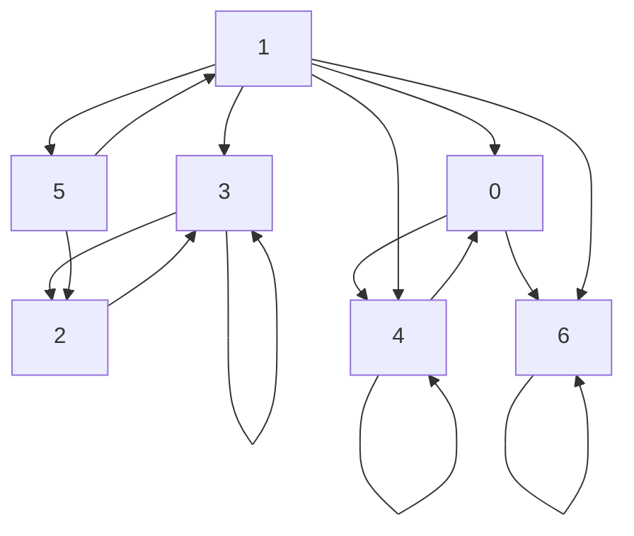
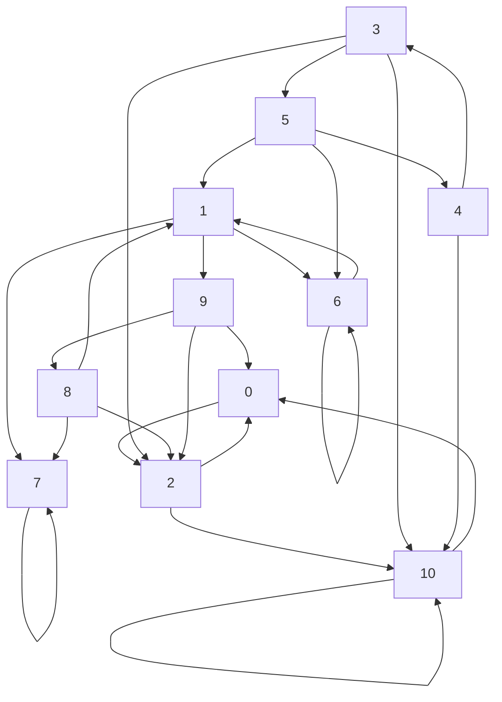

# GRE-Labo1-Markov

## Visualisation des graphes 
Utilisation de Mermaid pour visualiser les graphes.




## Résultats
Note: sur Tarjan uniquement

```

Calculating the components of the graph in data/chaine1.txt:
Graph: 15 edges.
successorLists: [[4, 6], [0, 3, 4, 5, 6], [3], [2, 3], [0, 4], [1, 2], [6]]
Tarjan: With 4 scc.
Details: [2, 4, 3, 3, 2, 4, 1]


Calculating the components of the graph in data/chaine2.txt:
Graph: 25 edges.
successorLists: [[2], [6, 7, 9], [0, 10], [10, 2, 5], [10, 3], [4, 6, 1], [6, 1], [7], [2, 7, 1], [0, 2,
8], [0, 10]]
Tarjan: With 4 scc.
Details: [1, 3, 1, 4, 4, 4, 3, 2, 3, 3, 1]

```