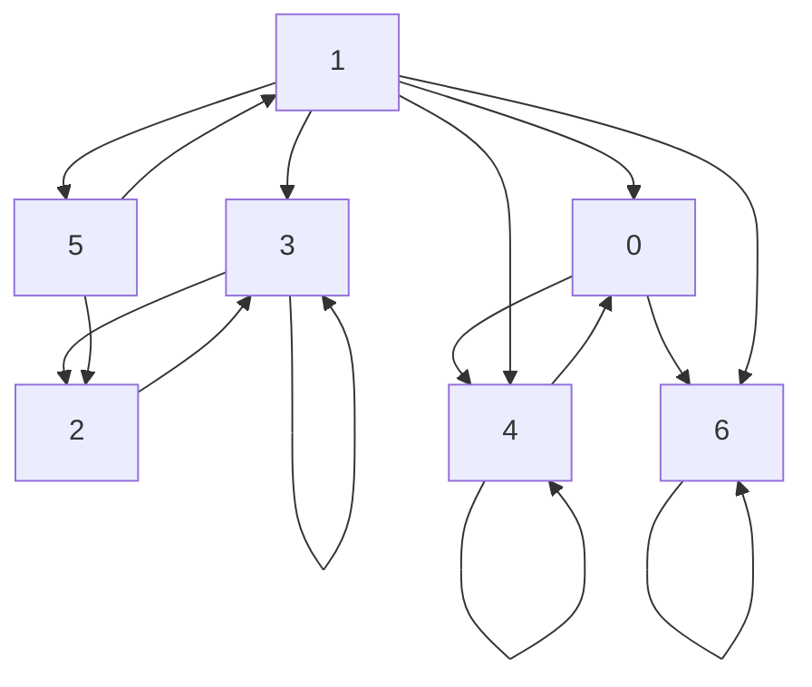
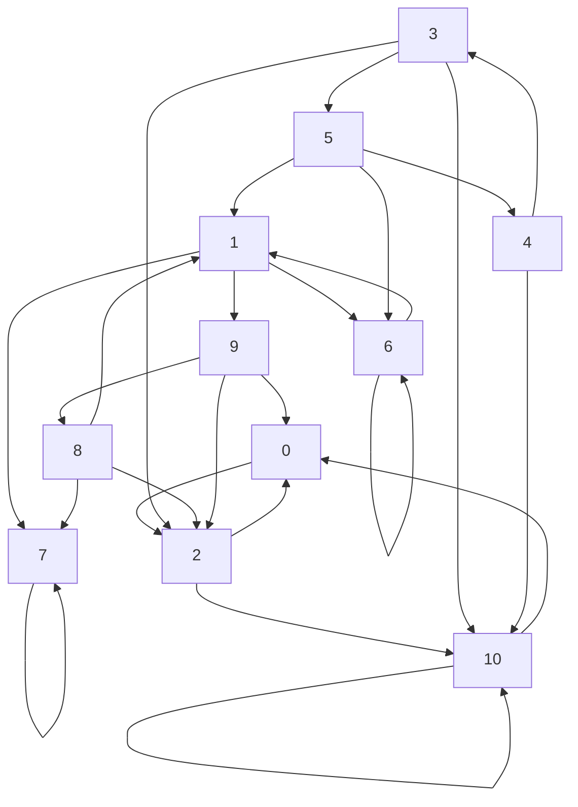

# GRE-Labo1-Markov

## Visualisation des graphes 
Utilisation de Mermaid pour visualiser les graphes.




## Résultats
```
Labo 1 - GRE

>> Calculating the SCC of the graph in data/chaine1.txt:

Strongly Connected Component: C0
Statut: persistant
Included vertices: [6]

Strongly Connected Component: C1
Statut: transitive
Included vertices: [0, 4]
Successors list: [0]

Strongly Connected Component: C2
Statut: persistant
Included vertices: [2, 3]

Strongly Connected Component: C3
Statut: transitive
Included vertices: [1, 5]
Successors list: [1, 2, 0]
mapping: [[6], [0, 4], [2, 3], [1, 5]]


>> Calculating the SCC of the graph in data/chaine2.txt:

Strongly Connected Component: C0
Statut: persistant
Included vertices: [0, 2, 10]

Strongly Connected Component: C1
Statut: persistant
Included vertices: [7]

Strongly Connected Component: C2
Statut: transitive
Included vertices: [1, 6, 8, 9]
Successors list: [1, 0]

Strongly Connected Component: C3
Statut: transitive
Included vertices: [3, 4, 5]
Successors list: [0, 2]
mapping: [[0, 2, 10], [7], [1, 6, 8, 9], [3, 4, 5]]
```